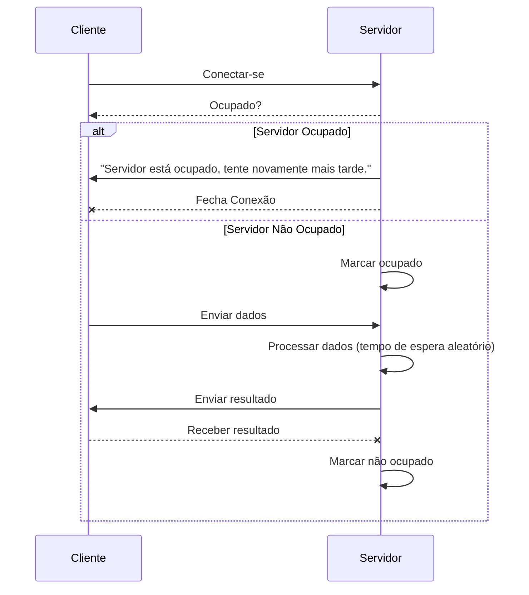

### Servidor que aceite a ligação de um cliente de cada vez

```mermaid
sequenceDiagram
    participant Cliente
    participant Servidor

    Cliente->>Servidor: Conectar-se
    Servidor-->>Cliente: Ocupado?
    alt Servidor Ocupado
        Servidor->>Cliente: "Servidor está ocupado, tente novamente mais tarde."
        Servidor--x Cliente: Fecha Conexão
    else Servidor Não Ocupado
        Servidor->>Servidor: Marcar ocupado
        Cliente->>Servidor: Enviar dados
        Servidor->>Servidor: Processar dados (tempo de espera aleatório)
        Servidor->>Cliente: Enviar resultado
        Cliente--x Servidor: Receber resultado
        Servidor->>Servidor: Marcar não ocupado
    end

```
