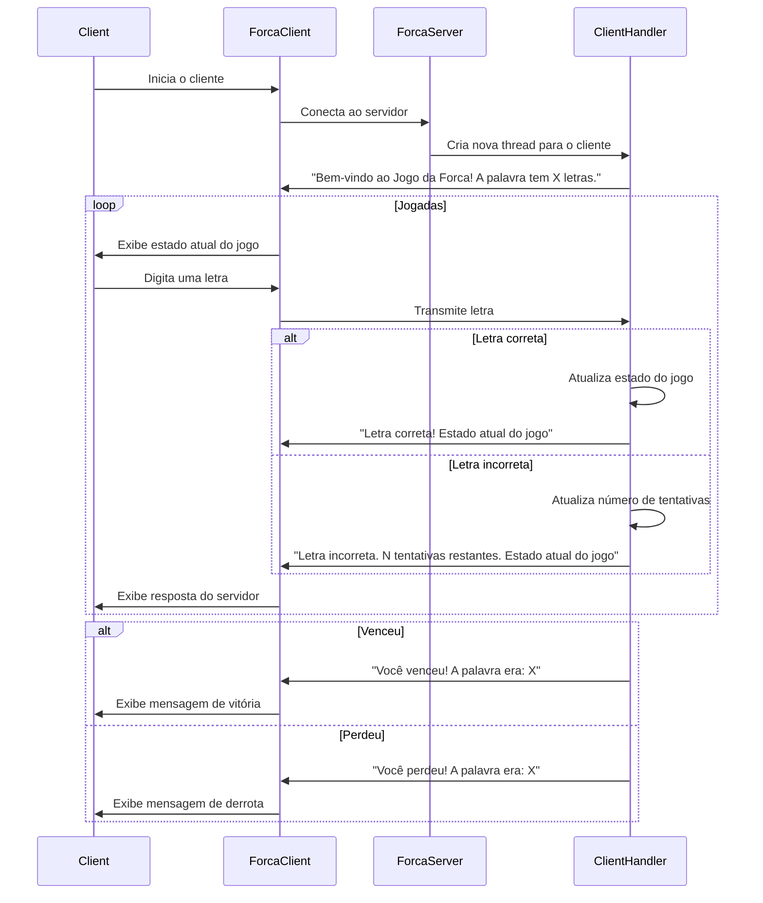

# Jogo da Forca
Implemente um jogo da forca remoto com 1 jogador. A definição da palavra a ser adivinhada ficará no
servidor, sendo que ao início o servidor dará o tamanho da palavra (em caracteres). Faça a simulação
em texto do jogo, retornando cada parte do boneco ou o caractere da palavra do servidor para o
cliente. 

