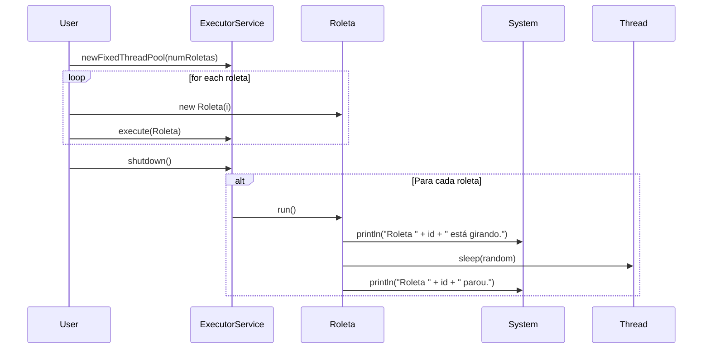
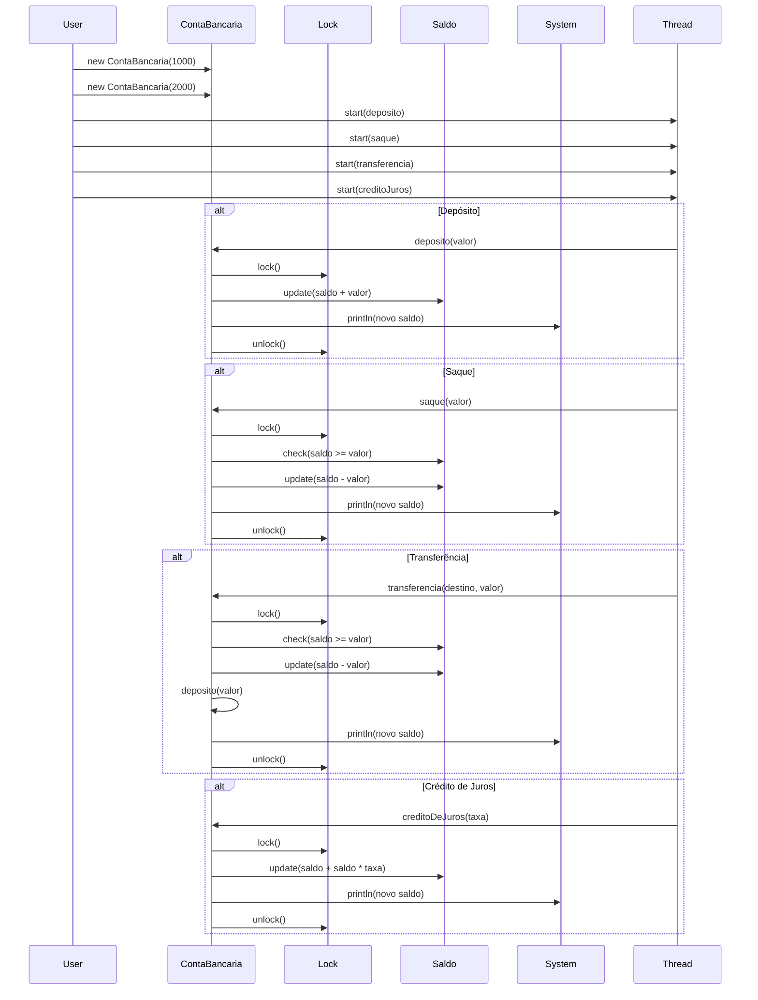
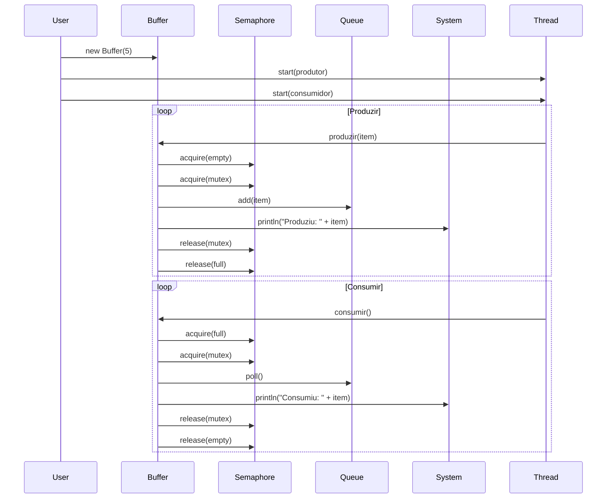
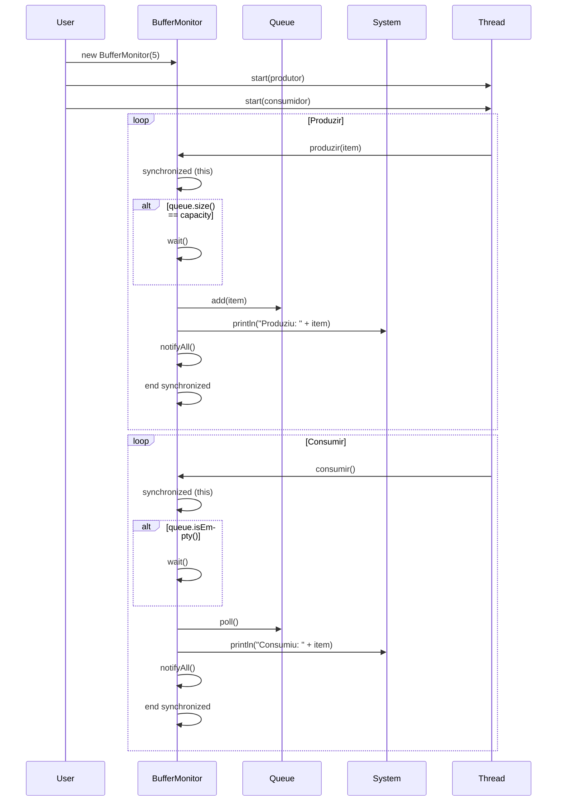

### Problema das roletas

```mermaid
sequenceDiagram
    participant User
    participant ExecutorService
    participant Roleta
    participant System
    participant Thread

    User ->> ExecutorService: newFixedThreadPool(numRoletas)
    loop for each roleta
        User ->> Roleta: new Roleta(i)
        User ->> ExecutorService: execute(Roleta)
    end
    User ->> ExecutorService: shutdown()

    alt Para cada roleta
        ExecutorService ->> Roleta: run()
        Roleta ->> System: println("Roleta " + id + " está girando.")
        Roleta ->> Thread: sleep(random)
        Roleta ->> System: println("Roleta " + id + " parou.")
    end
```

### Problema das Contas Bancárias

```mermaid
sequenceDiagram
    participant User
    participant ContaBancaria
    participant Lock
    participant Saldo
    participant System
    participant Thread

    User ->> ContaBancaria: new ContaBancaria(1000)
    User ->> ContaBancaria: new ContaBancaria(2000)
    User ->> Thread: start(deposito)
    User ->> Thread: start(saque)
    User ->> Thread: start(transferencia)
    User ->> Thread: start(creditoJuros)

    alt Depósito
        Thread ->> ContaBancaria: deposito(valor)
        ContaBancaria ->> Lock: lock()
        ContaBancaria ->> Saldo: update(saldo + valor)
        ContaBancaria ->> System: println(novo saldo)
        ContaBancaria ->> Lock: unlock()
    end

    alt Saque
        Thread ->> ContaBancaria: saque(valor)
        ContaBancaria ->> Lock: lock()
        ContaBancaria ->> Saldo: check(saldo >= valor)
        ContaBancaria ->> Saldo: update(saldo - valor)
        ContaBancaria ->> System: println(novo saldo)
        ContaBancaria ->> Lock: unlock()
    end

    alt Transferência
        Thread ->> ContaBancaria: transferencia(destino, valor)
        ContaBancaria ->> Lock: lock()
        ContaBancaria ->> Saldo: check(saldo >= valor)
        ContaBancaria ->> Saldo: update(saldo - valor)
        ContaBancaria ->> ContaBancaria: deposito(valor)
        ContaBancaria ->> System: println(novo saldo)
        ContaBancaria ->> Lock: unlock()
    end

    alt Crédito de Juros
        Thread ->> ContaBancaria: creditoDeJuros(taxa)
        ContaBancaria ->> Lock: lock()
        ContaBancaria ->> Saldo: update(saldo + saldo * taxa)
        ContaBancaria ->> System: println(novo saldo)
        ContaBancaria ->> Lock: unlock()
    end

```

### Problema das Produtor/Consumidor (Semáforos)

```mermaid
sequenceDiagram
    participant User
    participant Buffer
    participant Semaphore
    participant Queue
    participant System
    participant Thread

    User ->> Buffer: new Buffer(5)
    User ->> Thread: start(produtor)
    User ->> Thread: start(consumidor)

    loop Produzir
        Thread ->> Buffer: produzir(item)
        Buffer ->> Semaphore: acquire(empty)
        Buffer ->> Semaphore: acquire(mutex)
        Buffer ->> Queue: add(item)
        Buffer ->> System: println("Produziu: " + item)
        Buffer ->> Semaphore: release(mutex)
        Buffer ->> Semaphore: release(full)
    end

    loop Consumir
        Thread ->> Buffer: consumir()
        Buffer ->> Semaphore: acquire(full)
        Buffer ->> Semaphore: acquire(mutex)
        Buffer ->> Queue: poll()
        Buffer ->> System: println("Consumiu: " + item)
        Buffer ->> Semaphore: release(mutex)
        Buffer ->> Semaphore: release(empty)
    end

```

### Problema das Produtor/Consumidor (Monitores)

```mermaid
sequenceDiagram
    participant User
    participant BufferMonitor
    participant Queue
    participant System
    participant Thread

    User ->> BufferMonitor: new BufferMonitor(5)
    User ->> Thread: start(produtor)
    User ->> Thread: start(consumidor)

    loop Produzir
        Thread ->> BufferMonitor: produzir(item)
        BufferMonitor ->> BufferMonitor: synchronized (this)
        alt queue.size() == capacity
            BufferMonitor ->> BufferMonitor: wait()
        end
        BufferMonitor ->> Queue: add(item)
        BufferMonitor ->> System: println("Produziu: " + item)
        BufferMonitor ->> BufferMonitor: notifyAll()
        BufferMonitor ->> BufferMonitor: end synchronized
    end

    loop Consumir
        Thread ->> BufferMonitor: consumir()
        BufferMonitor ->> BufferMonitor: synchronized (this)
        alt queue.isEmpty()
            BufferMonitor ->> BufferMonitor: wait()
        end
        BufferMonitor ->> Queue: poll()
        BufferMonitor ->> System: println("Consumiu: " + item)
        BufferMonitor ->> BufferMonitor: notifyAll()
        BufferMonitor ->> BufferMonitor: end synchronized
    end

```
