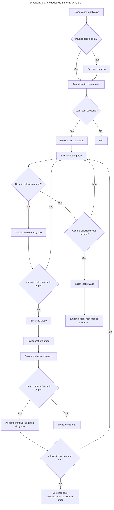

<h1 align="center">
    
    WhatsUT 
</h1>
<h3 align="center">
💬  Aplicativo de sistema para comunicação interpessoal real-time utilizando Java RMI 
</h3>

### Comandos

Lista de comandos utilizados no aplicativo
| Comando | Descrição |
| ----------- | ----------- |
| `/help` | Ajuda com os recursos |
| `/members` | Visualiza a listagem de membros |
| `/invites` | Visualiza a listagem de pedidos de entrar em um chat |
| `/accept {user_name}` | Aceitar um usuário específico no chat |
| `/ban {user_name}` | Banir um usuário específico no chat |
| `/exit` | Sair do chat |

> Caso o administrador do grupo saia, o aplicativo deve decidir quem será o novo administrador, ou se o grupo seja eliminado. Tal opção pode ser ajustada no momento da criação do chat em grupo.

### Diagrama de sequência

### Tecnologias utilizadas

- Java
- Java RMI
- Swing
